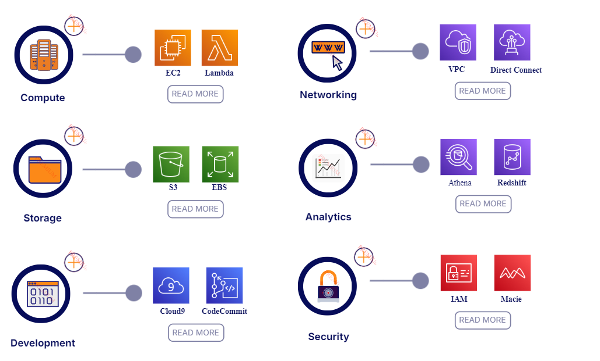
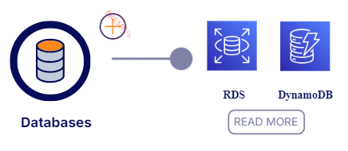
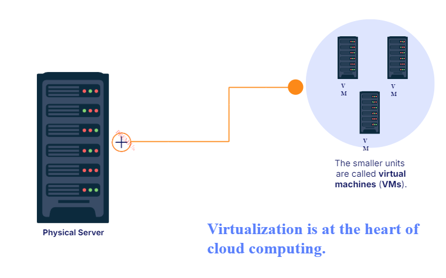

# Cloud Computing
> Is the on-demand delivery of IT resources over the internet with pay-as-you-go pricing.
> On-demand delivery indicates that AWS has the resources you need, when you need them.
> Is the delivery of computing services over the Internet.
> In AWS, you only pay for what you use. 
> AWS owns and maintains the network-connected hardware required for these application services, while you provision and use what you need via a web application.
> [01B-Advantages of Cloud Computing](01B-Advantages%20of%20Cloud%20Computing.md)

## Virtual Machines
> Virtualization lets you divide hardware resources on a single physical server into smaller units.
> Its at the heart of Cloud Computing.

## Usage
1. On Demand: No long-term commitments or upfront payments.
2. Pay as You Go: Pay by the hour or the second for only what you use.