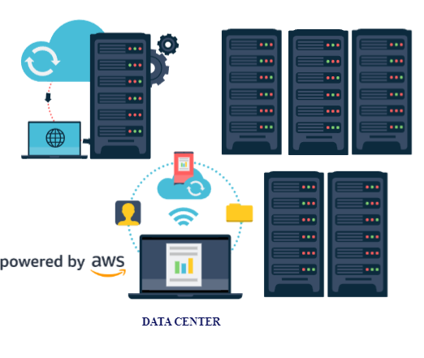

# Cloud Deployment Models
> When selecting a cloud strategy, a company must consider factors such as required cloud application components, preferred resource management tools, and any legacy IT infrastructure requirements.
## Private Cloud: On-premises deployment
- Deploy resources by using virtualization and resource management tools.
- Increase resource utilization by using application management and virtualization technologies.
- Resources are deployed on premises by using virtualization and resource management tools.
- Your resources like servers and DB are all on premises.
- Your local network or private cloud is your internal data center.
- It has none of the cloud advantages, but it offer more security of your data as it is not traversing any public space and isn't shared with other organizations with virtualization.
- For example, you might have applications that run on technology that is fully kept in your on-premises data center. Though this model is much like legacy IT infrastructure, its incorporation of application management and virtualization technologies helps to increase resource utilization.

	

## Public Cloud: Cloud Based Deployment
- Offered by AWS, Azure and GCP.
- You don't have any hardware responsibility as they provide all the hardware that provides the services you use.
- Run all parts of the application in the cloud.
- Migrate existing applications to the cloud.
- Design and build new applications in the cloud.
- You can migrate existing applications to the cloud, or you can design and build new applications in the cloud.
- You can build those applications on low-level infrastructure that requires your IT staff to manage them.
- This option has all of the advantages of the cloud.
- For example, a company might create an application consisting of virtual servers, databases, and networking components that are fully based in the cloud.

	

## Hybrid Cloud
- Connect cloud-based resources to on-premises infrastructure.
- Integrate cloud-based resources with legacy IT applications.
- Brings private and public together.
- Typically have their sensitive data stored locally and securely connect to the public cloud or AWS using services like VPN and Direct Connect.
- VPN can create a secure connection into the public cloud for, say, creating new resources in AWS and Direct Connect creates a secure connection for data to move from the public cloud to the private cloud without traversing the public internet.
- For example, suppose that a company wants to use cloud services that can automate batch data processing and analytics. However, the company has several legacy applications that are more suitable on premises and will not be migrated to the cloud. With a hybrid deployment, the company would be able to keep the legacy applications on premises while benefiting from the data and analytics services that run in the cloud.

	