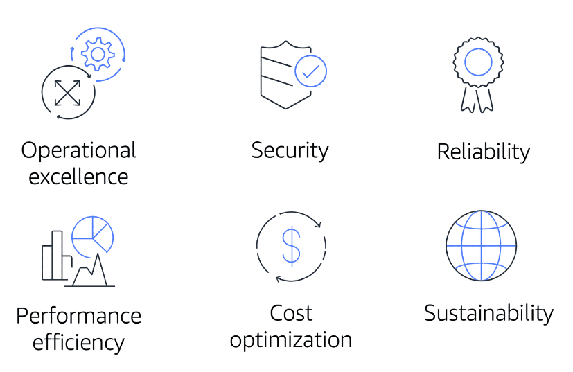

# The AWS Well-Architected Framework
- Helps cloud architects build secure, high-performing, resilient, and efficient infrastructure for a variety of applications and workloads.
- It provides a way for you to consistently measure your architecture against best practices and design principles and identify areas for improvement.

	

- Operational Excellence: Is the ability to run and monitor systems to deliver business value and to continually improve supporting processes and procedures. Design principles for operational excellence in the cloud include performing operations as code, annotating documentation, anticipating failure, and frequently making small, reversible changes.
- Security: The **Security** pillar is the ability to protect information, systems, and assets while delivering business value through risk assessments and mitigation strategies. Good practices:
	- Automate security best practices when possible.
	- Apply security at all layers.
	- Protect data in transit and at rest.
- Reliability: Ability of a system to do the following:
	- Recover from infrastructure or service disruptions
	- Dynamically acquire computing resources to meet demand
	- Mitigate disruptions such as misconfigurations or transient network issues
- Performance efficiency: Ability to use computing resources efficiently to meet system requirements and to maintain that efficiency as demand changes and technologies evolve.  Evaluating the performance efficiency of your architecture includes experimenting more often, using serverless architectures, and designing systems to be able to go global in minutes.
- Cost optimization: Ability to run systems to deliver business value at the lowest price point.  Cost optimization includes adopting a consumption model, analyzing and attributing expenditure, and using managed services to reduce the cost of ownership.
- Sustainability: Ability to continually improve sustainability impacts by reducing energy consumption and increasing efficiency across all components of a workload by maximizing the benefits from the provisioned resources and minimizing the total resources required. To facilitate good design for sustainability:
	- Understand your impact
	- Establish sustainability goals
	- Maximize utilization
	- Anticipate and adopt new, more efficient hardware and software offerings
	- Use managed services
	- Reduce the downstream impact of your cloud workloads