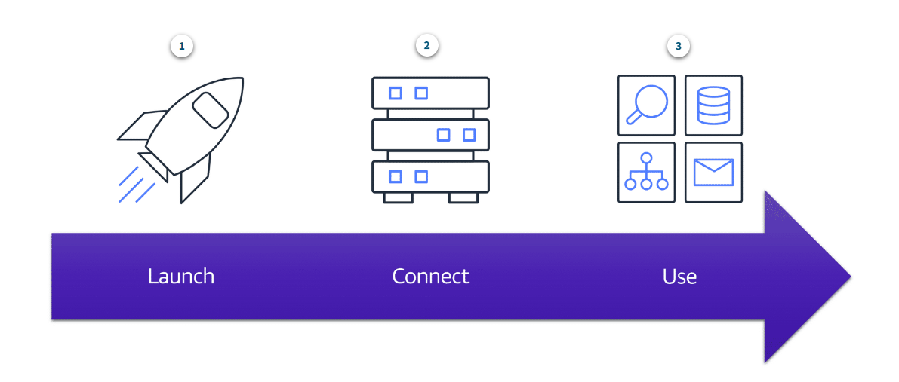
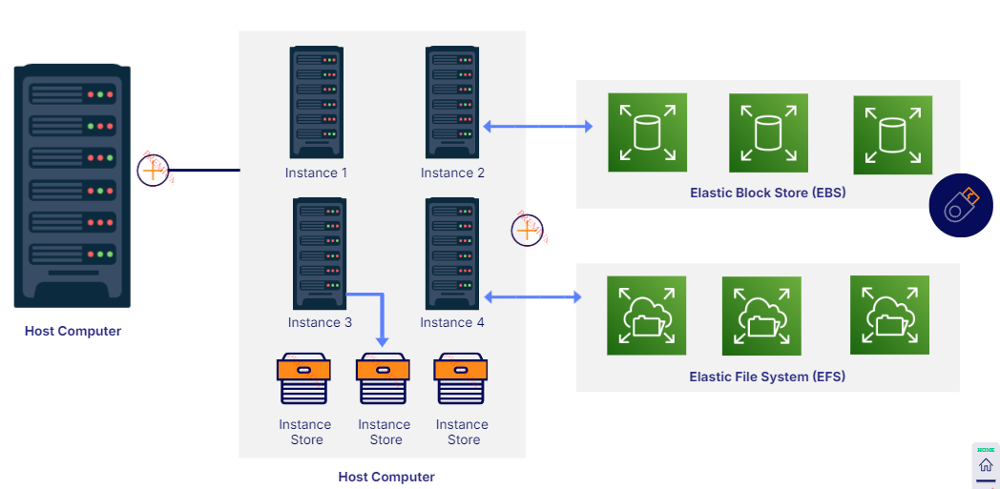

# Amazon Elastic Compute Cloud(EC2)
- Allows you to **rent and manage virtual servers in the Cloud**.
- Provides secure, resizable compute capacity in the cloud as Amazon EC2 instances.
- When you're working with AWS, the servers are virtual, and the service you use to gain access to virtual servers is called EC2.
	- You can provision and launch an Amazon EC2 instance within minutes.
	- You can stop using it when you have finished running a workload.
	- You pay only for the compute time you use when an instance is running, not when it is stopped or terminated.
	- You can save costs by paying only for server capacity that you need or want.
	- You can deploy your applications directly to EC2 instances.
	- You use a preconfigured template called an Amazon Machine Image(AMI) to launch your instance.

- Highly flexible, cost-effective and quick when you compare it to running your own servers on premises in a data center that you own.
- AWS took care of the hard part for you already. AWS already built and secured the data centers. AWS has already bought the servers, racked and stacked them, and they are already online ready to be used. AWS is constantly operating a massive amount of compute capacity. And you can use whatever portion of that capacity when you need it.
- Multitenancy: Sharing underlying hardware between Virtual Machines. EC2 runs on top of physical host machines managed by AWS using virtualization technology.
- The hypervisor is responsible for coordinating this multitenancy and it is managed by AWS. The hypervisor is responsible for isolating the virtual machines from each other as they share resources from the host.
- EC2 instances are also resizable.
- With an Amazon EC2 instance you can use a virtual server to run applications in the AWS Cloud.

	

	1. Launch: Begin by selecting a template with basic configurations for your instance(operating system, application server, or applications). You also select the instance type, which is the specific hardware configuration of your instance. You also specify security settings to control the network traffic that can flow into and out of your instance.
	2. Connect: Your programs and applications have multiple different methods to connect directly to the instance and exchange data. Users can also connect to the instance by logging in and accessing the computer desktop.
	3. Use: You can run commands to install software, add storage, copy and organize files, and more.

## Usage
1. Deploying a DataBase: Gives you full control over the DB.
2. Deploy a Web Application: Deploy to multiple [08B-Availability Zones](../Module%203%20-%20Infrastructure%20and%20Realiability/08B-Availability%20Zones.md) to make the Web Application highly available.

## Storage

