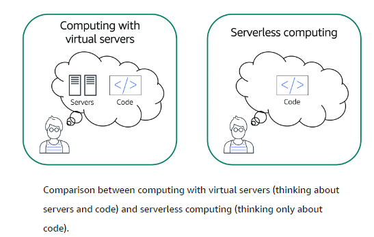

# Serverless computing
- **Serverless**: Your code runs on servers, but you do not need to provision or manage these servers. With serverless computing, **you can focus more on innovating new products and features instead of maintaining servers**.
- **Flexibility to scale applications automatically**: Serverless computing can adjust the applications' capacity by modifying the units of consumptions, such as throughput and memory.

	