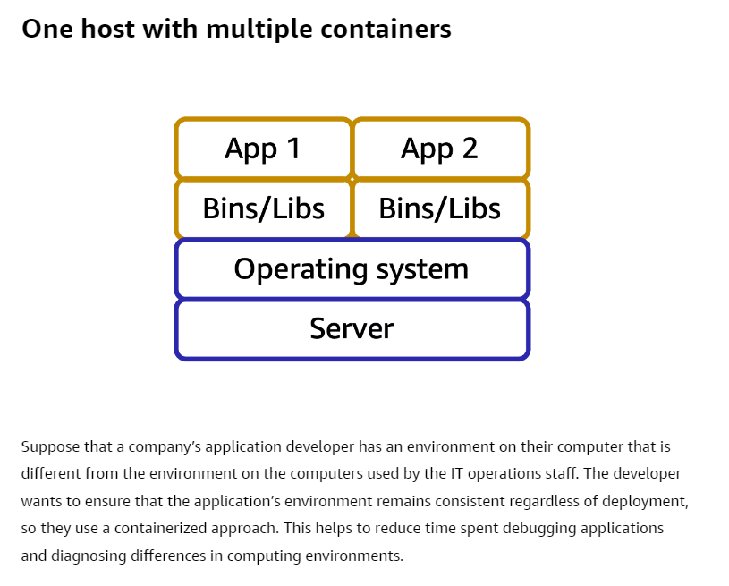
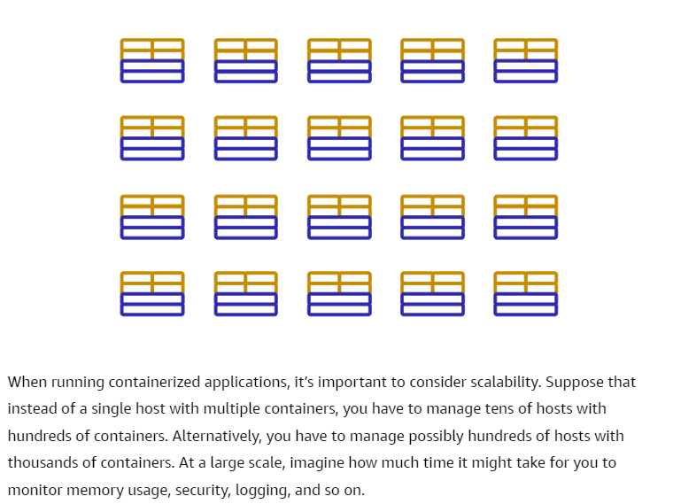

# Containerized Applications
> **Containers**: **Provide you with a standard way to package your application's code and dependencies into a single object**. 
> They also can be use for processes and workflows in which there are essential requirements for security, reliability, and scalability.

## Amazon Elastic Container Service(Amazon ECS)
- Highly scalable, high-performance container management system that enables you to run and scale containerized applications on AWS. 
- Amazon ECS supports Docker containers. 
- **Docker** is a software platform that enables you to build, test, and deploy applications quickly. With Amazon ECS, you can use API calls to launch and stop Docker-enabled applications.
## Amazon Elastic Kubernetes Service(Amazon EKS)
- Fully managed service that you can use to run Kubernetes on AWS. 
- **Kubernetes** is open-source software that enables you to deploy and manage containerized applications at scale. A large community of volunteers maintains Kubernetes, and AWS actively works together with the Kubernetes community. As new features and functionalities release for Kubernetes applications, you can easily apply these updates to your applications managed by Amazon EKS.

## AWS Fargate
- [07A-Serverless Computing](07A-Serverless%20Computing.md) engine for containers. It works with both Amazon ECS and Amazon EKS. 
- Allows you to manage containers, like Docker.
- Scales automatically.
- When using AWS Fargate, you do not need to provision or manage servers. AWS Fargate manages your server infrastructure for you. 
- **You can focus more on innovating and developing your applications, and you pay only for the resources that are required to run your container**s.

## AWS Lightsail
- Allows you to quickly launch all the resources you need for small projects.
- Deploy preconfigured applications, like WordPress websites.
- Simple screens for people with no Cloud experience.
- Includes a virtual machine, SSD-based storage, data transfer, DNS management and a static IP.

## AWS Outposts
- Run Cloud services in your internal data center.
- Support workloads that need to remain on-premises due to latency or data sovereignty needs.
- AWS delivers and installs servers in your internal data center.
- Used for a hybrid experience.
- Have access to the Cloud Services and APIs to develop apps on-premises.

## AWS Batch
- Process large workloads in smaller chunks.
- Runs hundreds and thousands of smaller batch processing jobs.
- Dynamically provisions instances based on volume.