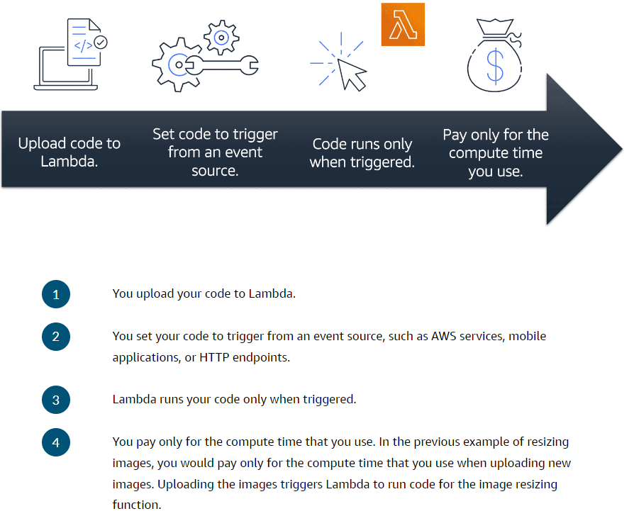

# AWS Lambda
- Is a [07A-Serverless Computing](07A-Serverless%20Computing.md) service that lets you run code without managing servers.
- **Lets you run code without needing to provision or manage servers**.
- You author application code, called functions, using many popular languages.
- Scales automatically.
- You don't worry about managing servers like with [04A-Amazon Elastic Compute Cloud(EC2)](04A-Amazon%20Elastic%20Compute%20Cloud(EC2).md).
- While using AWS Lambda, **you pay only for the compute time that you consume**. Charges apply only when your code is running. You can also run code for virtually any type of application or backend service, all with zero administration.
- Allows developers to focus on core business logic for the apps they are developing instead of worrying about managing servers.

	

- Lambda is a building block for many serverless applications:

	
