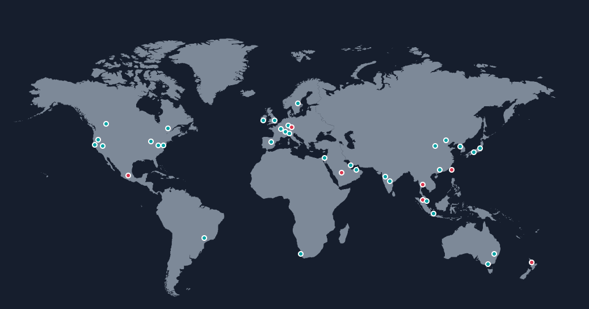
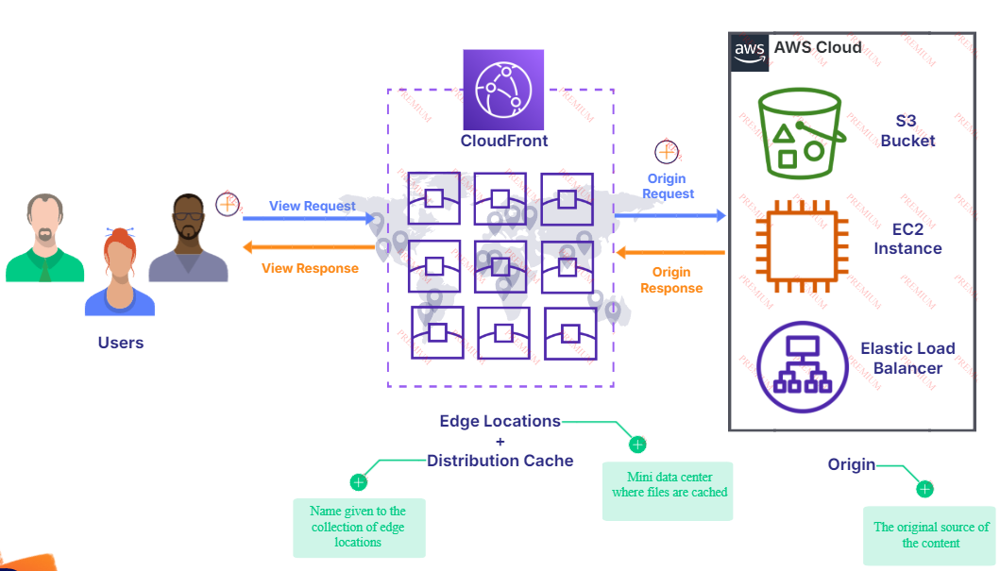
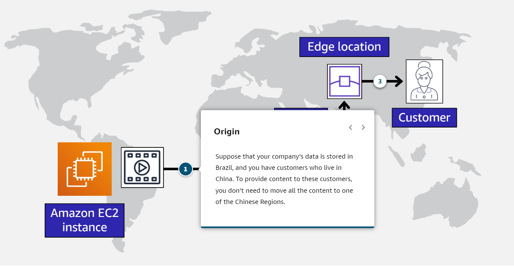
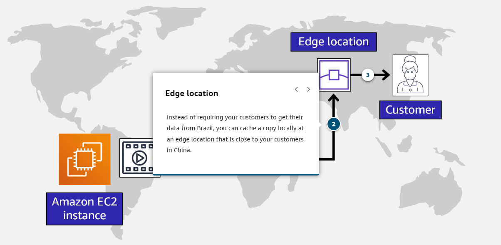
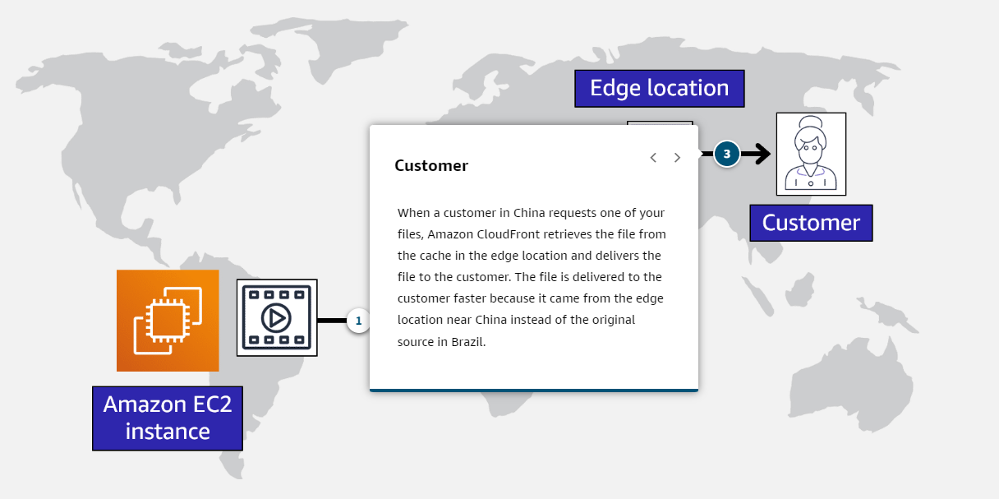

# AWS Global Infrastructure
- Throughout the globe, AWS builds Regions to be closest to where the business traffic demands. Inside each Region, we have multiple data centers that have all the compute, storage, and other services you need to run your applications.
- **Each Region can be connected to each other Region** through a high speed fiber network, controlled by AWS, a truly global operation from corner to corner if you need it to be.
- **Each Region is isolated from every other Region**: absolutely no data goes in or out of your environment in that Region without you explicitly granting permission for that data to be moved.
- **Each Region is composed by a group of data centers**(is a physical location). Each one of these groups are called [08B-Availability Zones](08B-Availability%20Zones.md).

	

## Selecting a Region
- **Compliance with data governance and legal requirements**: Depending on your company and location, you might need to run your data out of specific areas. For example, if your company requires all of its data to reside within the boundaries of the UK, you would choose the London Region.
- **Proximity to your customers**: Selecting a Region that is close to your customers will help you to get content to them faster. For example, your company is based in Washington, DC, and many of your customers live in Singapore. You might consider running your infrastructure in the Northern Virginia Region to be close to company headquarters, and run your applications from the Singapore Region.
- **Available services within a Region**: Sometimes, the closest Region might not have all the features that you want to offer to customers. Making new services available around the world sometimes requires AWS to build out physical hardware one Region at a time.
- **Pricing**.

## Edge Locations
- **Amazon CloudFront**: Content delivery network (CDN) that allows you to store your content at "edge locations" located all around the world, allowing customers to access your content more quickly.
	- It alone doesn't ensure high availability.
	- Delivers data and applications globally with low latency.
	- Makes content available globally or restricts it based on location.
	- Speeds up delivery of static and dynamic web content.

	

- An **edge location** is a site that Amazon CloudFront uses to store cached copies of your content closer to your customers for faster delivery.
- AWS Edge Location caches are physically in the data centers, they are distributed globally to be as close as possible to the end users. 
- Edge locations cache content for **fast delivery** to your users. -> Ensure low latency by placing content closer to users.
- They are not linked to AWS regions.

	
	

	
