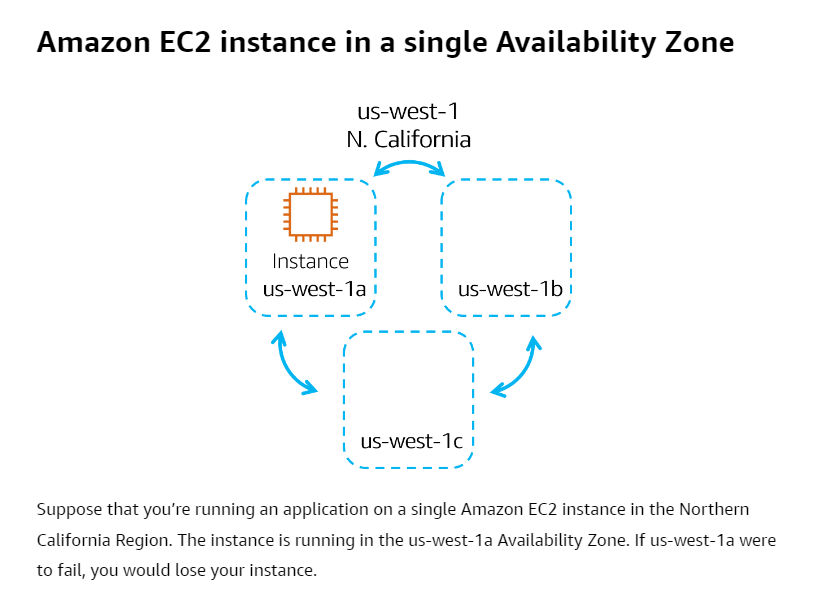
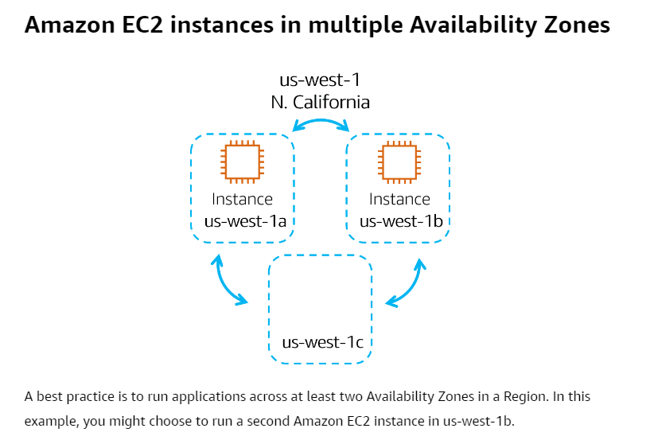
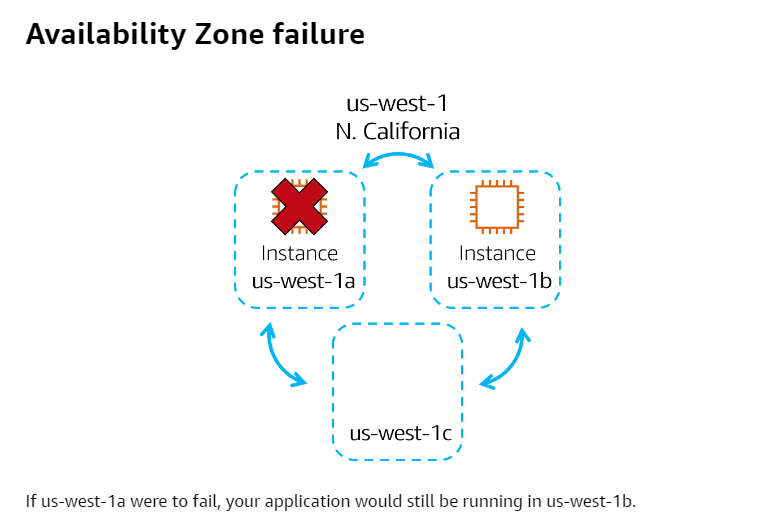

# Availability Zones
- Single data center or a group of data centers within a Region. -> Collection of data centers.
- Data center -> Contains multiple **servers**: physical compute hardware running in a data center.
- [04A-Amazon Elastic Compute Cloud(EC2)](../Module%202%20-%20Compute%20in%20the%20Cloud/04A-Amazon%20Elastic%20Compute%20Cloud(EC2).md) are the virtual servers running on these physical servers.
- Availability Zones are located tens of miles apart from each other. This is close enough to have low latency (the time between when content requested and received) between Availability Zones. 
- If a disaster occurs in one part of the Region, they are distant enough to reduce the chance that multiple Availability Zones are affected.
- **Fault Tolerant**: Enables a system to continue operating properly in the event of the failure of one or more components.
- Allows for **high availability**.
- Best practice: Run applications across at least two Availability Zones in a Region -> High availability.

