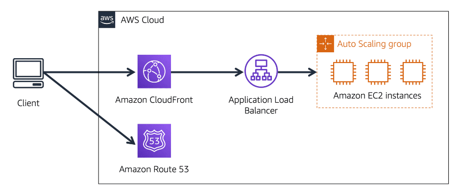

# Amazon Route 53
- DNS web service. **It gives developers and businesses a reliable way to route end users to internet applications hosted in AWS**.
- Connects user requests to infrastructure running in AWS (such as [04A-Amazon Elastic Compute Cloud(EC2)](../Module%202%20-%20Compute%20in%20the%20Cloud/04A-Amazon%20Elastic%20Compute%20Cloud(EC2).md) instances and load balancers). It can route users to infrastructure outside of AWS.
- This enables you to manage all of your domain names within a single location.

## How Amazon Route 53 and Amazon CloudFront deliver content

1. A customer requests data from the application by going to AnyCompany’s website.
2. Amazon Route 53 uses DNS resolution to identify AnyCompany.com’s corresponding IP address, 192.0.2.0. This information is sent back to the customer.
3. The customer’s request is sent to the nearest edge location through Amazon CloudFront.
4. Amazon CloudFront connects to the Application Load Balancer, which sends the incoming packet to an Amazon EC2 instance.