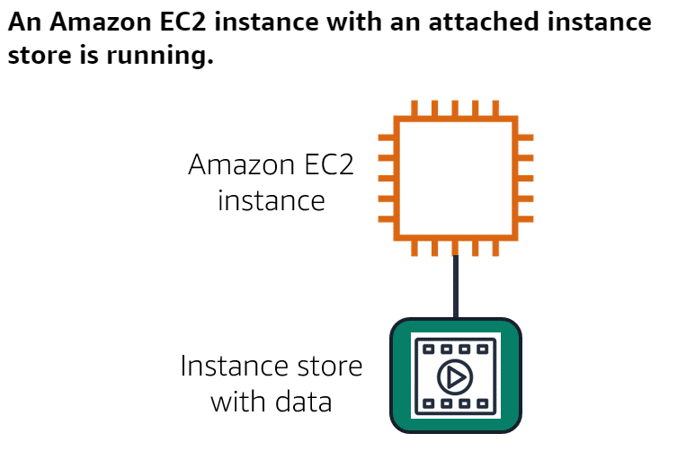
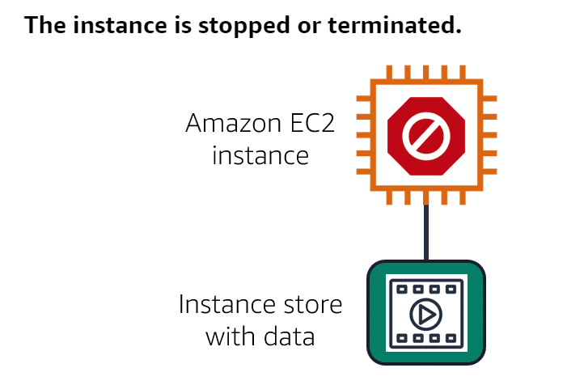
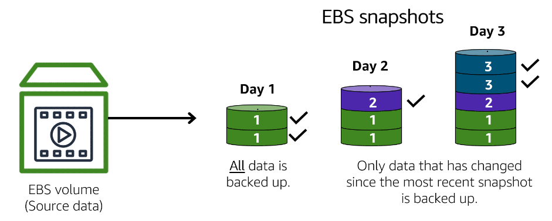

# Instance Stores
- Block-level storage volumes behave like physical hard drives.
- Provides temporary block-level storage for an [04A-Amazon Elastic Compute Cloud(EC2)](../Module%202%20-%20Compute%20in%20the%20Cloud/04A-Amazon%20Elastic%20Compute%20Cloud(EC2).md) instance.
- An instance storage is **disk storage that is physically attached to the host computer for an EC2 instance, and therefore has the same lifespan as the instance**.
- When the instance is terminated, you lose any data in the instance store.

	

	

	

## Amazon Elastic Block Store(EBS)
-  **Provides block-level storage volumes that you can use with Amazon EC2 instances.**
- If you stop or terminate an Amazon EC2 instance, all the data on the attached EBS volume remains available.
- To create an EBS volume, **you define the configuration (such as volume size and type) and provision it**. After you create an EBS volume, **it can attach to an Amazon EC2 instance**.
- Because EBS volumes are for data that needs to persist, it’s important to back up the data. **You can take incremental backups of EBS volumes by creating Amazon EBS snapshots**.

	

## Amazon EBS Snapshots
- **An incremental backup**. 
- The first backup taken of a volume copies all the data. For subsequent backups, only the blocks of data that have changed since the most recent snapshot are saved.
- **Incremental backups are different from full backups, in which all the data in a storage volume copies each time a backup occurs**. The full backup includes data that has not changed since the most recent backup.

	