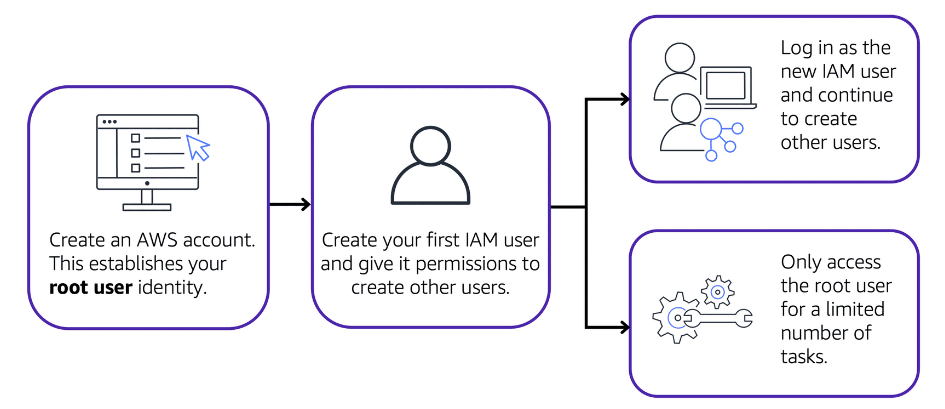
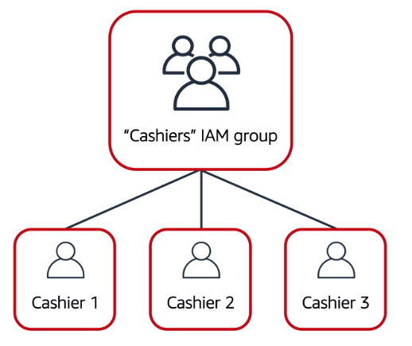
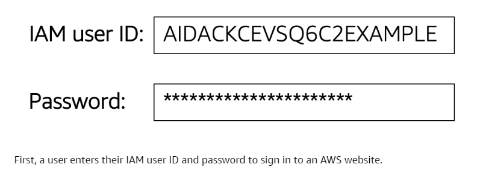
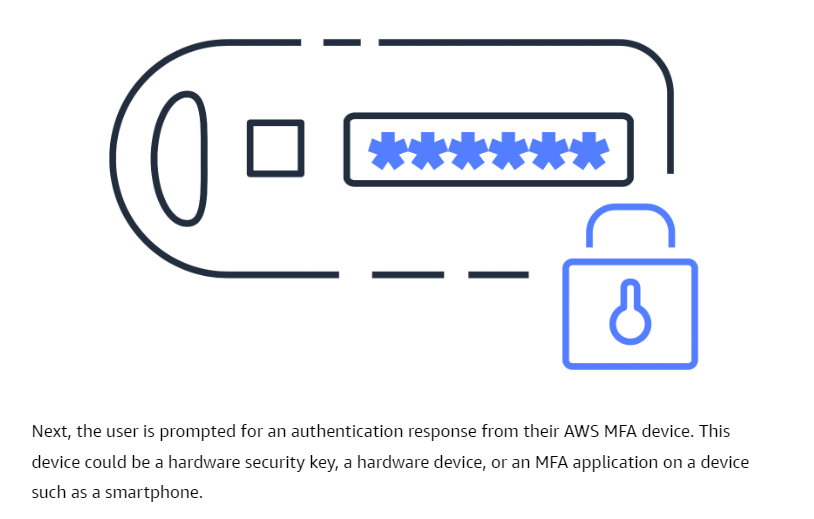

# AWS Identity and Access Management(IAM)
- **Enables to manage access to AWS services and resources securely**.
- **Gives the flexibility to configure access based on your company's specific operational and security needs**. You do this by using a combination of IAM features:
	- IAM users, groups and roles.
	- IAM policies.
	- Muti-factor authentication.

## AWS account root user
- **When you first create an AWS account, you begin with an identity known as the root user**.
- The root user is accessed by signing in with the email address and password that you used to create your AWS account.
- It has complete access to all the AWS services and resources in the account.

	

### Best practice
- Do **not** use the root user for everyday tasks. 
- Instead, **use the root user to create your first IAM user and assign it permissions to create other users.**
- Then, continue to create other IAM users, and access those identities for performing regular tasks throughout AWS. Only use the root user when you need to perform a limited number of tasks that are only available to the root user. 

## IAM users
- An **IAM user** is an identity that you create in AWS.
- **It represents the person or application that interacts with AWS services and resources**. It consists of a name and credentials.
- By default, when you create a new IAM user in AWS, it has no permissions associated with it. To allow the IAM user to perform specific actions in AWS, such as launching an [04A-Amazon Elastic Compute Cloud(EC2)](../Module%202%20-%20Compute%20in%20the%20Cloud/04A-Amazon%20Elastic%20Compute%20Cloud(EC2).md) instance or creating an [14B-Amazon Simple Storage Service(S3)](../Module%205%20-%20Storage%20and%20Databases/14B-Amazon%20Simple%20Storage%20Service(S3).md) bucket, you must grant the IAM user the necessary permissions.

### Best practice
- **You create individual IAM users for each person who needs to access AWS**.  
- Even if you have multiple employees who require the same level of access, you should create individual IAM users for each of them. **This provides additional security by allowing each IAM user to have a unique set of security credentials.**

## IAM Policies
- **IAM** **policy**: Document that **allows or denies permissions to AWS services and resources**.
- Enable you to customize users’ levels of access to resources. 
- For example, you can allow users to access all of the Amazon S3 buckets within your AWS account, or only a specific bucket.

### Best practice
- Follow the security principle of **least privilege** when granting permissions. 
- By following this principle, **you help to prevent users or roles from having more permissions than needed to perform their tasks**. 
- For example, if an employee needs access to only a specific bucket, specify the bucket in the IAM policy. Do this instead of granting the employee access to all of the buckets in your AWS account.

## IAM Groups
- **A collection of IAM users**. 
- **When you assign an IAM policy to a group, all users in the group are granted permissions specified by the policy**.

	

	- Assigning IAM policies at the group level also makes it easier to adjust permissions when an employee transfers to a different job. 
	- For example, if a cashier becomes an inventory specialist, the coffee shop owner removes them from the “Cashiers” IAM group and adds them into the “Inventory Specialists” IAM group. This ensures that employees have only the permissions that are required for their current role.

## IAM Roles
- **IAM role**: Identity that you can assume to **gain temporary access to permissions**.
- Before an IAM user, application, or service can assume an IAM role, they must be granted permissions to switch to the role. 
- **When someone assumes an IAM role, they abandon all previous permissions that they had under a previous role and assume the permissions of the new role**.

### Best Practice
- IAM roles are ideal for situations in which access to services or resources needs to be granted temporarily, instead of long-term.

## Multi-factor Authentication
- In IAM, **multi-factor authentication (MFA) provides an extra layer of security for your AWS account**.

	

	