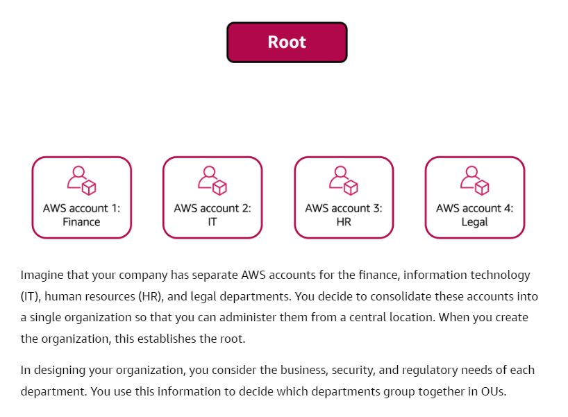
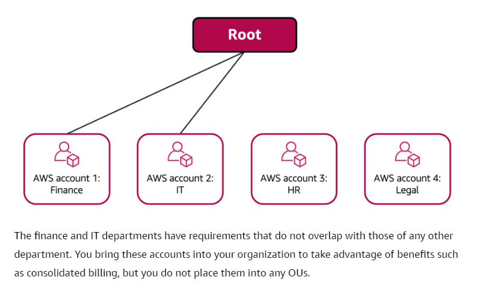
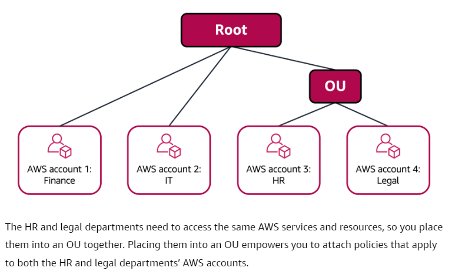

# AWS Organizations
- **Consolidate and manage multiple AWS accounts within a central location**.
- When you create an organization, AWS Organizations automatically creates a **root** -> Is the parent container for all the accounts in your organization.
- You can centrally control permissions for the accounts in your organization by using service control policies (SCPs).
- SCPs enable you to place restrictions on the AWS services, resources, and individual API actions that users and roles in each account can access.

## Organizational Units
- You can group accounts into organizational units (OUs) to make it easier to manage accounts with similar business or security requirements. 
- **When you apply a policy to an OU, all the accounts in the OU automatically inherit the permissions specified in the policy**.
- **By organizing separate accounts into OUs, you can more easily isolate workloads or applications that have specific security requirements.**

	

	

	
