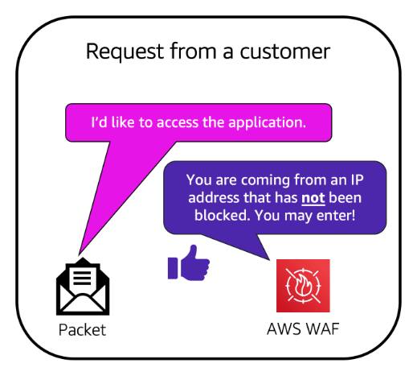

# AWS Key Management Service(AWS KMS)
- You must ensure that your applications’ data is secure while in storage **(encryption at rest)** and while it is transmitted, known as **encryption in transit**.
- KMS enables you to perform encryption operations through the use of **cryptographic keys**. 
- A cryptographic key is a random string of digits used for locking (encrypting) and unlocking (decrypting) data. 
- You can use AWS KMS to create, manage, and use cryptographic keys. 
- You can also control the use of keys across a wide range of services and in your applications.
- With AWS KMS, you can choose the specific levels of access control that you need for your keys. For example, you can specify which IAM users and roles are able to manage keys. Alternatively, you can temporarily disable keys so that they are no longer in use by anyone. Your keys never leave AWS KMS, and you are always in control of them.

# AWS WAF
- Is a web application firewall that lets you monitor network requests that come into your web applications.
- Protection against SQL injection attacks.
- AWS WAF works together with Amazon CloudFront and an Application Load Balancer. AWS WAF works in a similar way to block or allow traffic. However, it does this by using a web ACL to protect your AWS resources.
- You configure the web ACL to allow all requests except those from the IP addresses that you have specified.
- When a request comes into AWS WAF, it checks against the list of rules that you have configured in the web ACL. If a request does not come from one of the blocked IP addresses, it allows access to the application.

	

	
	- If a request comes from one of the blocked IP addresses that you have specified in the web ACL, AWS WAF denies access.