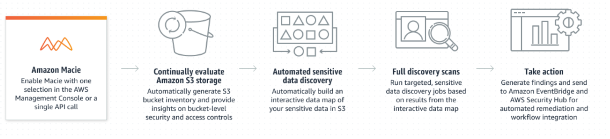

# Amazon Macie
- Data security service that uses machine learning (ML) and pattern matching to discover and help protect your sensitive data.
- It provides visibility into data security risks, and enables automated protection against those risks.

	

## Use cases
- **Strengthen your data security posture**: Discover sensitive data across your S3 environment to increase visibility and automated remediation of data security risks.
- **Discover sensitive data for compliance**: Schedule data analysis to certify that sensitive data is discovered and protected.
- **Protect sensitive data during migration**: During data ingestion, determine if sensitive data has been appropriately protected.
- **Increase visibility for business-critical data**: Automatically and continually monitor all your sensitive data stored in S3 buckets.