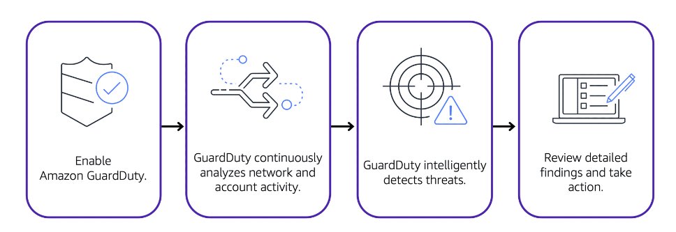

# Amazon GuardDuty
- **Automatic monitoring for threats to AWS workloads**. -> Keep your accounts, workloads, and data secure by continuously monitoring for potential threats across your AWS environment.
- Expose threats quickly using anomaly detection, machine learning (ML), behavioral modeling, and threat intelligence feeds from AWS and leading third parties.
- Accurately detect and respond to threats earlier, helping you detect them before they escalate to broader business-impacting events.
- Scale threat detection across all accounts in your AWS environment without requiring manual effort or third-party tooling.
- Safeguard your accounts, data, and resources across various AWS compute types, spanning [04A-Amazon Elastic Compute Cloud(EC2)](../Module%202%20-%20Compute%20in%20the%20Cloud/04A-Amazon%20Elastic%20Compute%20Cloud(EC2).md), [07A-Serverless Computing](../Module%202%20-%20Compute%20in%20the%20Cloud/07A-Serverless%20Computing.md) workloads, and container workloads—including those on AWS Fargate.
- Provides intelligent threat detection for your AWS infrastructure and resources. It identifies threats by continuously monitoring the network activity and account behavior within your AWS environment.

	

- After you have enabled GuardDuty for your AWS account, GuardDuty begins monitoring your network and account activity. 
- You do not have to deploy or manage any additional security software. GuardDuty then continuously analyzes data from multiple AWS sources, including VPC Flow Logs and DNS logs.
- If GuardDuty detects any threats, you can review detailed findings about them from the AWS Management Console. Findings include recommended steps for remediation. 
- You can also configure AWS Lambda functions to take remediation steps automatically in response to GuardDuty’s security findings.

## Use cases
- **Detect suspicious activity in your generative AI workloads**.
- **Accelerate investigations and automate remediation**.
- **Protect against ransomware and other types of malware**.
- **Centralize threat detection for AWS container workloads**.
- **More easily meet compliance requirements, like PCI DSS**.