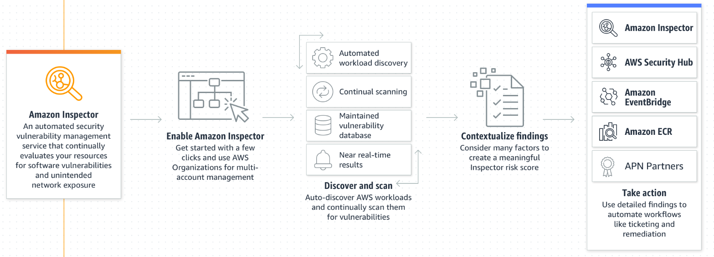

# Amazon Inspector
- Automatically discovers workloads, such as [04A-Amazon Elastic Compute Cloud(EC2)](../Module%202%20-%20Compute%20in%20the%20Cloud/04A-Amazon%20Elastic%20Compute%20Cloud(EC2).md), containers, and Lambda functions, and scans them for software vulnerabilities and unintended network exposure.
- Is an automated vulnerability management service that **continually scans AWS workloads for software vulnerabilities and unintended network exposure.**
- Helps to improve the security and compliance of applications by running **automated security assessments.**
- It checks applications for security vulnerabilities and deviations from security best practices, such as open access to Amazon EC2 instances and installations of vulnerable software versions.
- After Amazon Inspector has performed an assessment, it provides you with a list of security findings. The list prioritizes by severity level, including a detailed description of each security issue and a recommendation for how to fix it.
- AWS does not guarantee that following the provided recommendations resolves every potential security issue.
- Under the [21-AWS Shared Responsibility Model](21-AWS%20Shared%20Responsibility%20Model.md), customers are responsible for the security of their applications, processes, and tools that run on AWS services.
- Detect software vulnerabilities.
- Manage SBOM exports centrally.
- Prioritize remediation.
- Maximize vulnerability assessment coverage.

	

## Use cases
- Quickly discover zero-day vulnerabilities in compute workloads.
- Prioritize patch remediation.
- Meet compliance requirements.
- Shift security earlier in development cycle.
