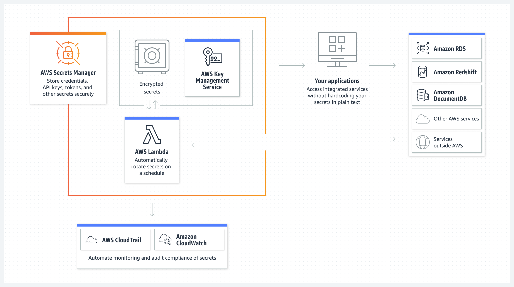

# AWS Secrets Manager
- Helps you manage, retrieve, and rotate database credentials, API keys, and other secrets throughout their lifecycles.
- Securely encrypt and centrally audit secrets such as database credentials and API keys.
- Manage access to secrets using fine-grained [22- AWS Identity and Access Management(IAM)](22-%20AWS%20Identity%20and%20Access%20Management(IAM).md) and resource-based policies.
- Rotate secrets automatically to meet your security and compliance requirements.
- Replicate secrets to support disaster recovery scenarios and multi-region applications.

	

## Use Cases
- Store secrets securely.
- Manage access with fine-grained policies.
- Automate secrets rotation.
- Audit and monitor secrets usage.