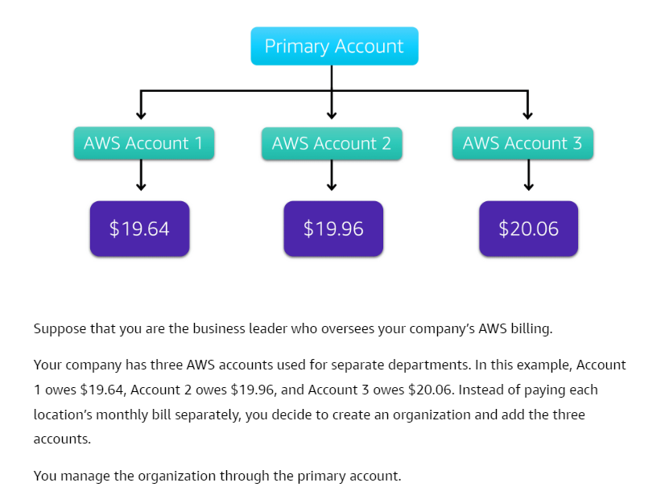
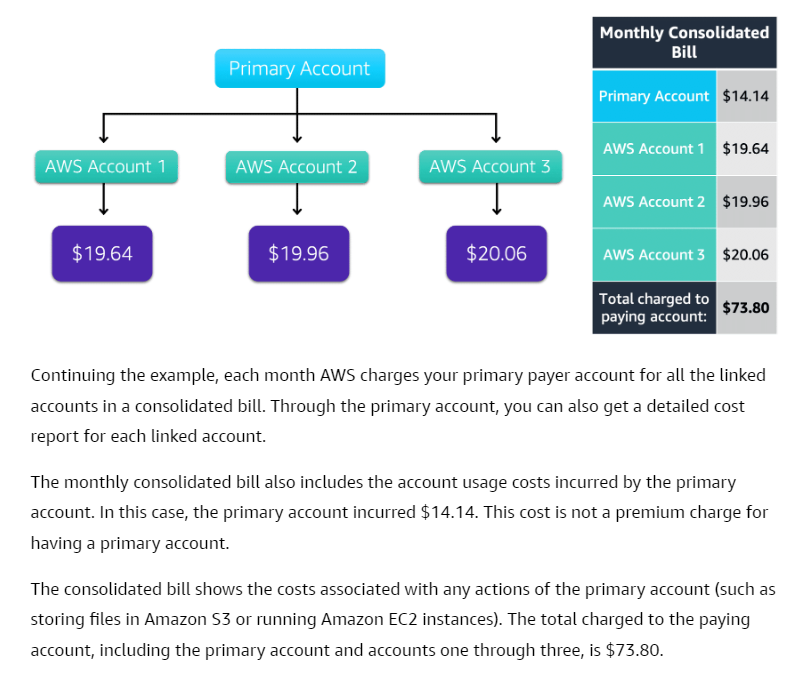
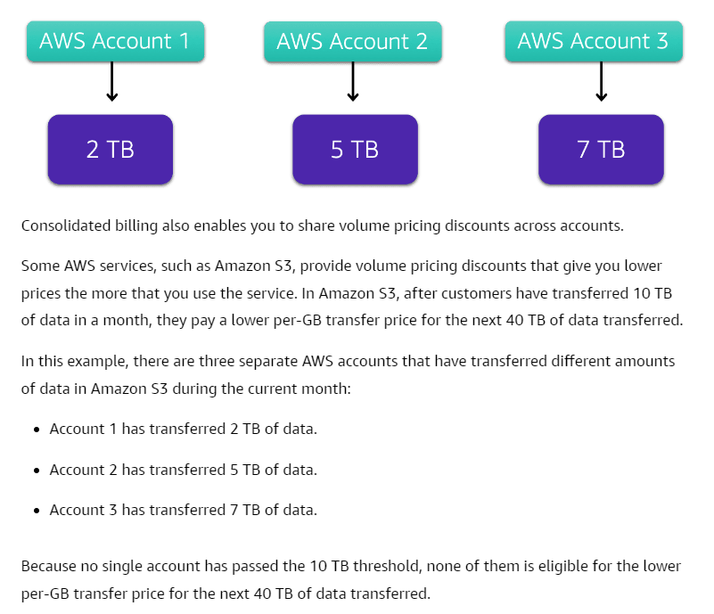

# Consolidated Billing
- The consolidated billing feature of [[23-AWS Organizations]] enables you to receive a single bill for all AWS accounts in your organization.
- By consolidating, you can easily track the combined costs of all the linked accounts in your organization. The default maximum number of accounts allowed for an organization is 4, but you can contact AWS Support to increase your quota, if needed.
- On your monthly bill, you can review itemized charges incurred by each account. This enables you to have greater transparency into your organization’s accounts while still maintaining the convenience of receiving a single monthly bill.
- Another benefit of consolidated billing is the ability to share bulk discount pricing, Savings Plans, and Reserved Instances across the accounts in your organization. For instance, one account might not have enough monthly usage to qualify for discount pricing. However, when multiple accounts are combined, their aggregated usage may result in a benefit that applies across all accounts in the organization.

	

	

	