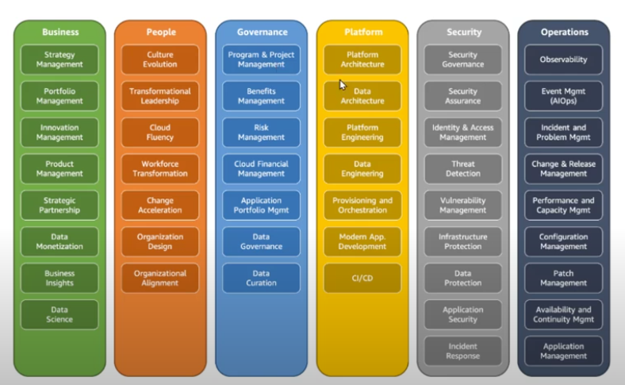

# AWS Cloud Adoption Framework
- Leverages AWS experience and best practices to help you digitally transform and accelerate your business outcomes through innovative use of AWS.
- It identifies specific organizational capabilities that underpin successful cloud transformations.
- These **capabilities provide best practice guidance that helps you improve your cloud readiness**.
- Organizes guidance into six areas of focus, called Perspectives. Each Perspective addresses distinct responsibilities. The planning process helps the right people across the organization prepare for the changes ahead.
- Each perspective comprises a set of capabilities that functionally related stakeholders own or manage in the cloud transformation journey.

	

## Business Perspective
- Helps **ensure that your cloud investments accelerate your digital transformation abitions and business outcomes**.
- **Stakeholders**: Chief executive officer (CEO), chief financial officer (CFO), chief operations officer (COO), chief information officer (CIO), and chief technology officer (CTO).
- Ensures that IT aligns with business needs and that IT investments link to key business results.
- Use the Business Perspective to create a strong business case for cloud adoption and prioritize cloud adoption initiatives. Ensure that your business strategies and goals align with your IT strategies and goals.
- Common roles in the Business Perspective include: 
	- Business managers
	- Finance managers
	- Budget owners
	- Strategy stakeholders

## People Perspective 
- **Serves as a bridge between technology and business, accelerating the cloud journey to help organizations more rapidly evolve to a culture of continuous growth, learning, and where change becomes business-as-normal, with focus on culture, organizational structure, leadership, and workforce**.
- **Stakeholders**: CIO, COO, CTO, cloud director, and cross-functional and enterprise-wide leaders.
- The **People Perspective** supports development of an organization-wide change management strategy for successful cloud adoption.
- Use the People Perspective to evaluate organizational structures and roles, new skill and process requirements, and identify gaps. This helps prioritize training, staffing, and organizational changes.
- Common roles in the People Perspective include: 
	- Human resources
	- Staffing
	- People managers

## Governance Perspective
- Helps you **orchestrate your cloud initiatives while maximizing organizational benefits and minimizing transformation-related risks**.
- **Stakeholders**: Chief transformation officer, CIO, CTO, CFO, chief data officer (CDO), and chief risk officer (CRO).
- Focuses on organizing an inventory of data products in a data catalog. -> Explains the processes, roles and policies necessary to align IT strategy with business goals.
- The **Governance Perspective** focuses on the skills and processes to align IT strategy with business strategy. This ensures that you maximize the business value and minimize risks.
- Use the Governance Perspective to understand how to update the staff skills and processes necessary to ensure business governance in the cloud. Manage and measure cloud investments to evaluate business outcomes.
- Common roles in the Governance Perspective include: 
	- Chief Information Officer (CIO)
	- Program managers
	- Enterprise architects
	- Business analysts
	- Portfolio managers

## Platform Perspective
- Helps you build an enterprise-grade, scalable, hybrid cloud platform, modernize existing workloads, and implement new cloud-native solutions.
- **Stakeholders**: CTO, technology leaders, architects, and engineers.
- The **Platform Perspective** includes principles and patterns for implementing new solutions on the cloud, and migrating on-premises workloads to the cloud.
- Use a variety of architectural models to understand and communicate the structure of IT systems and their relationships. Describe the architecture of the target state environment in detail.
- Common roles in the Platform Perspective include: 
	- Chief Technology Officer (CTO)
	- IT managers
	- Solutions architects

## Security Perspective
- Helps you achieve the confidentiality, integrity, and availability of your data and cloud workloads
- **Stakeholders**: Chief information security officer (CISO), chief compliance officer (CCO), internal audit leaders, and security architects and engineers.
- The **Security Perspective** ensures that the organization meets security objectives for visibility, auditability, control, and agility. 
- Use the AWS CAF to structure the selection and implementation of security controls that meet the organization’s needs.
- Common roles in the Security Perspective include: 
	- Chief Information Security Officer (CISO)
	- IT security managers
	- IT security analysts

## Operations Perspective
- Helps ensure that your cloud services are delivered at a level that meets the needs of your business.
- **Stakeholders**: Infrastructure and operations leaders, site reliability engineers, and information technology service managers. 
- The **Operations Perspective** helps you to enable, run, use, operate, and recover IT workloads to the level agreed upon with your business stakeholders.
- Define how day-to-day, quarter-to-quarter, and year-to-year business is conducted. Align with and support the operations of the business. The AWS CAF helps these stakeholders define current operating procedures and identify the process changes and training needed to implement successful cloud adoption.
- Common roles in the Operations Perspective include: 
	- IT operations managers
	- IT support managers