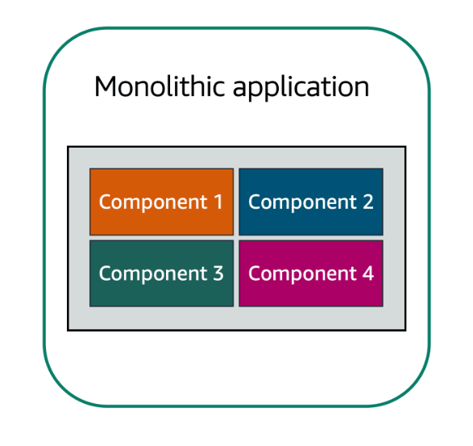
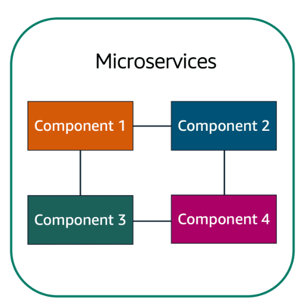
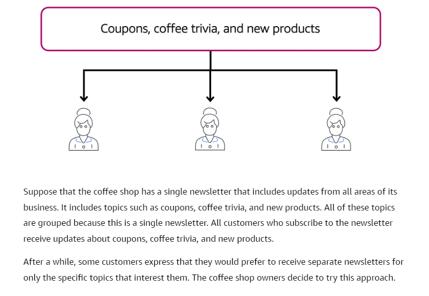
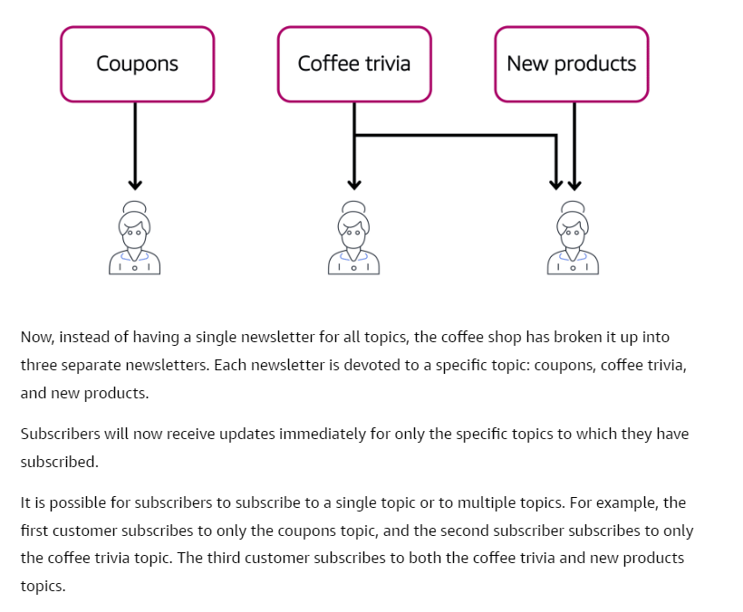
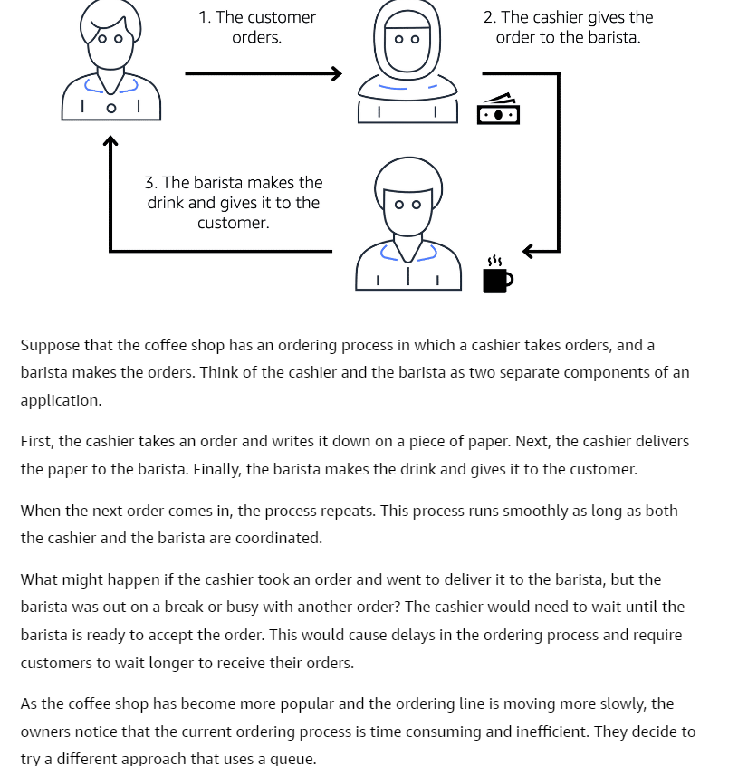
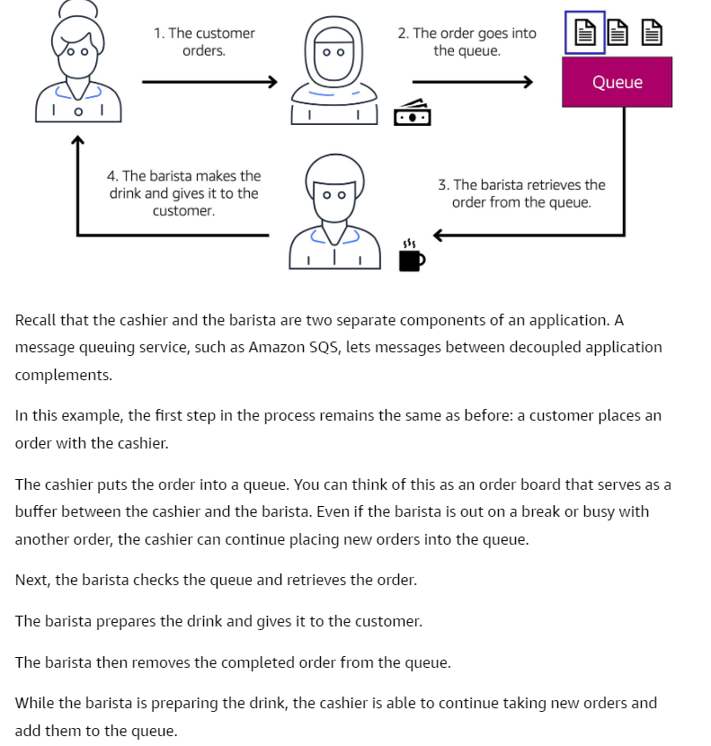

# Messaging and Queuing
> **Applications are made of multiple components. The components comunicate with each other** to transmit data, fulfill requests, and keep the application running.

# Monolithic Applications
- Type of architecture where the **applications has tightly coupled components**. These components might include databases, servers, the user interface, business logic, and so on.
- A single component fails -> The entire application fails
- To help maintain application availability when a single component fails, you can desing your application through a microservices approach.
	
	

# Microservices
- Application components are loosely coupled.
- A single component fails -> The other components continue to work because they are communicating with each other. 
- **The loose coupling prevents the entire application from failing**.
- **When designing applications on AWS, you can take a microservices approach with services and components that fulfill different functions.** 
- Two services facilitate application integration: Amazon Simple Notification Service (Amazon SNS) and Amazon Simple Queue Service (Amazon SQS).

	
## Amazon Simple Notification Service(Amazon SNS)
- Is a publish/subscribe service. Using Amazon SNS topics, a publisher publishes messages to subscribers.

	

	

## Amazon Simple Queue Service(Amazon SQS)
- Messaging queuing service.
- You can send, store, and receive messages between software components, without losing messages or requiring other services to be available. In Amazon SQS, an application sends messages into a queue. A user or service retrieves a message from the queue, processes it, and then deletes it from the queue.

	

	