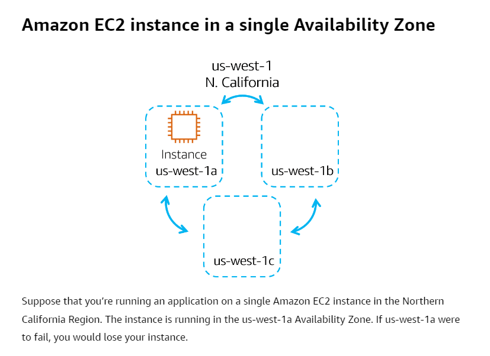
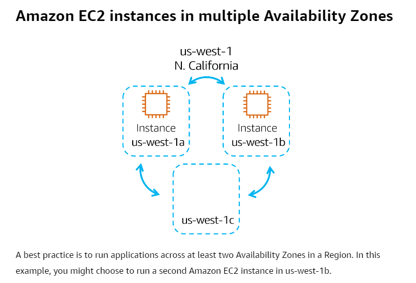

# Availability Zones
- Single data center or a group of data centers within a Region. 
- Availability Zones are located tens of miles apart from each other. This is close enough to have low latency (the time between when content requested and received) between Availability Zones. 
- If a disaster occurs in one part of the Region, they are distant enough to reduce the chance that multiple Availability Zones are affected.
- Best practice: Run applications across at least two Availability Zones in a Region.

