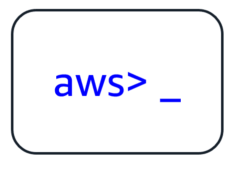
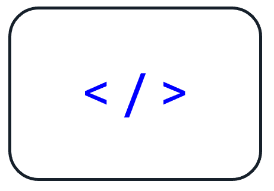

# Ways to interact with AWS services

## AWS Management Console
- **Web-based interface for accessing and managing AWS services**. You can quickly access recently used services and search for other services by name, keyword, or acronym. 
- The console includes wizards and automated workflows that can simplify the process of completing tasks.
- You can also use the AWS Console mobile application to perform tasks such as monitoring resources, viewing alarms, and accessing billing information. 
- Multiple identities can stay logged into the AWS Console mobile app at the same time.

	

## AWS Command Line Interface
- **Control multiple AWS services directly from the command line within one tool**. 
- Available for users on Windows, macOS, and Linux.
- By using AWS CLI, **you can automate the actions that your services and applications perform through scripts**. For example, you can use commands to launch an [04A-Amazon Elastic Compute Cloud(EC2)](../Module%202%20-%20Compute%20in%20the%20Cloud/04A-Amazon%20Elastic%20Compute%20Cloud(EC2).md) instance, connect an Amazon EC2 instance to a specific Auto Scaling group, and more.

	

## Software Development Kits(SDKs)
- **Use AWS services through an API designed for your programming language or platform**. 
- **SDKs enable you to use AWS services with your existing applications or create entirely new applications that will run on AWS**.
- AWS provides documentation and sample code for each supported programming language. Supported programming languages include C++, Java, .NET, and more.

	

## AWS Elastic Beanstalk(EB)
- **You provide code and configuration settings**, and EB deploys the resources necessary to perform the following tasks:
	- Adjust capacity.
	- Load balancing.
	- Automatic scaling.
	- Application health monitoring.

## AWS CloudFormation
- **Treat your infrastructure as code**. This means that **you can build an environment by writing lines of code instead of using the AWS Management Console** to individually provision resources.
- Provisions your resources in a safe, repeatable manner, enabling you to frequently build your infrastructure and applications without having to perform manual actions.
- It determines the right operations to perform when managing your stack and rolls back changes automatically if it detects errors.