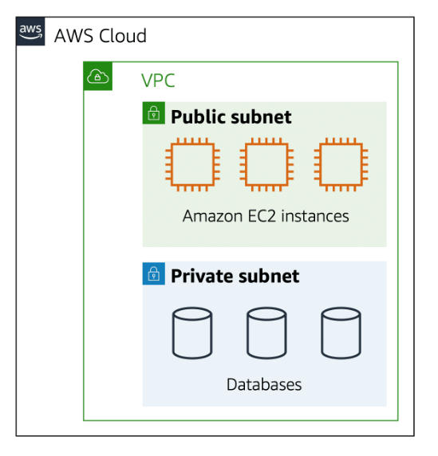
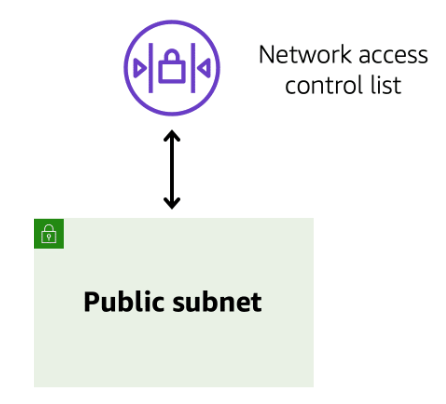
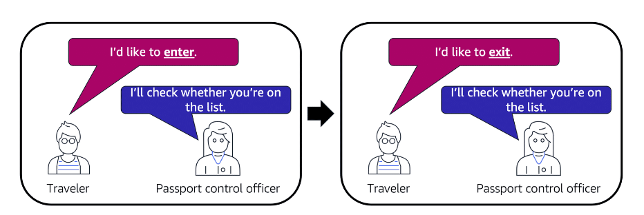
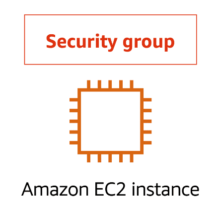
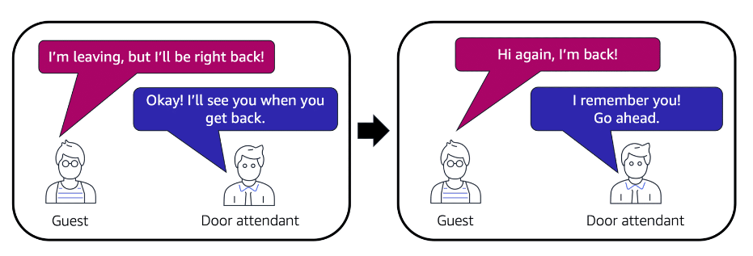
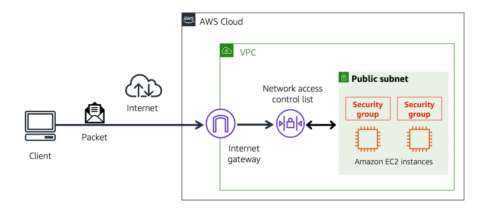

# Subnets
- A **subnet** is a section of a [10-Amazon Virtual Private Cloud(VPC)](10-Amazon%20Virtual%20Private%20Cloud(VPC).md) that can contain resources such as [04A-Amazon Elastic Compute Cloud(EC2)](../Module%202%20-%20Compute%20in%20the%20Cloud/04A-Amazon%20Elastic%20Compute%20Cloud(EC2).md) instances.  
- You can group resources based on security or operational needs.
- **Separate areas that are used to group together resources**: They can communicate with each other.

	
	
	- **Public Subnets**: **Contain resources that need to be accesible by the public**, such as an online store's website. Support the customer-facing website.
	- **Private subnets**: **Contain resources that should be accessible only through your private network**, such as a database that contains customer's personal information and order histories. They isolate databases containing customers' personal information.

## Network traffic in a VPC
- **Packet**: Unit of data sent over the internet or a network.
- When a customer requests data from an application hosted in the AWS Cloud, the request is sent as a packet.
- The packet enters into a VPC through an internet gateway. Before a packet can enter into a subnet or exit from a subnet, it checks for permissions. These permissions indicate who sent the packet and how the packet is trying to communicate with the resources in a subnet.

## Network Access Control List(ACLs)
- **Virtual firewall that controls inbound and outbound traffic at the subnet level**: It check packets permissions for subnets.
- **Each AWS account includes a default network ACL**. When configuring your VPC, you can use your account’s default network ACL or create custom network ACLs.
- **By default, your account’s default network ACL allows all inbound and outbound traffic**, but you can modify it by adding your own rules. 
- **For custom network ACLs, all inbound and outbound traffic is denied until you add rules to specify which traffic to allow**.

	

## Stateless packet filtering
- Network ACLs perform stateless packet filtering -> **They remember nothing and check packets that cross the subnet border each way: inbound and outbound**.
- When a packet response for that request comes back to the subnet, the network ACL does not remember your previous request. The network ACL checks the packet response against its list of rules to determine whether to allow or deny.

	

	- **After a packet has entered a subnet, it must have its permissions evaluated for resources within the subnet, such as EC2 instances**.

## Security Groups
- **VPC component that checks packet permissions for and EC2 instance**: Virtual firewall that controls inbound and outbound traffic for an EC2 instance.
- **By default, a security group denies all inbound traffic and allows all outbound traffic.** You can add custom rules to configure which traffic should be allowed; any other traffic would then be denied.
- With both network ACLs and security groups, you can configure custom rules for the traffic in your VPC.

	

	- If you have multiple Amazon EC2 instances within the same VPC, you can associate them with the same security group or use different security groups for each instance.

## Stateful packet filtering
- Security groups perform **stateful** packet filtering -> **They remember previous decisions made for incoming packets**.

	

	

