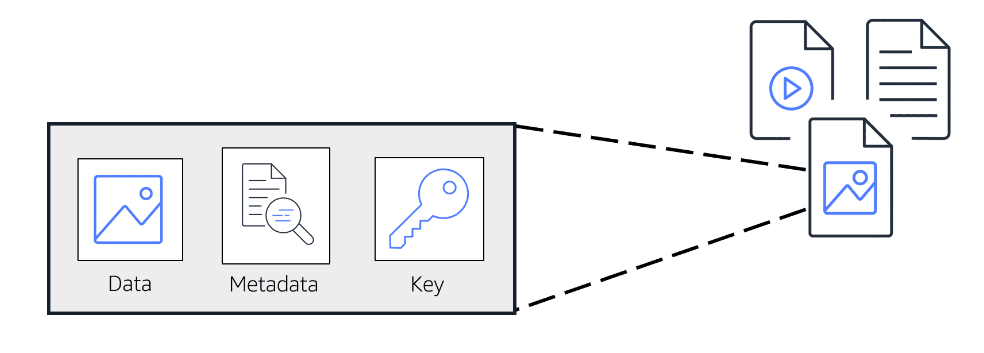

# Object Storage
- **Each object consists of data, metadata, and a key**.
- When you modify a file in block storage, only the pieces that are changed are updated. When a file in object storage is modified, the entire object is updated.
- The **data** might be an image, video, text document, or any other type of file. 
- **Metadata** contains information about what the data is, how it is used, the object size, and so on. 
- An object’s **key** is its unique identifier.
- AWS provides object-level storage with [14B-Amazon Simple Storage Service(S3)](14B-Amazon%20Simple%20Storage%20Service(S3).md).

	