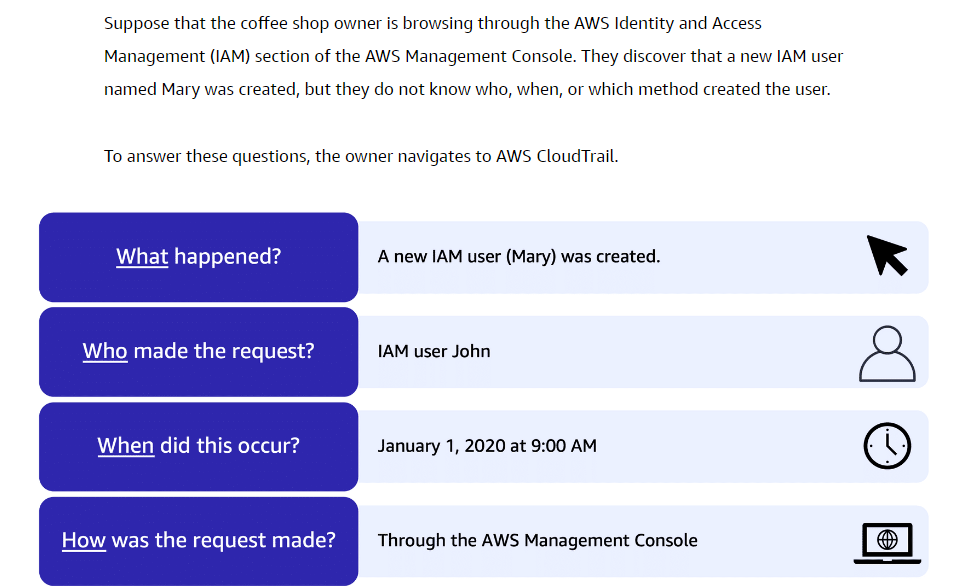

# AWS CloudTrail
- **Records API calls for your account**.
- **The recorded information includes the identity of the API caller, the time of the API call, the source IP address of the API caller, and more**.
- You can think of CloudTrail as a “trail” of breadcrumbs (or a log of actions) that someone has left behind them.
- You can view a complete history of user activity and API calls for your applications and resources.

	

## CloudTrail Insights
- This optional feature allows CloudTrail to **automatically detect unusual API activities in your AWS account**.
- For example, CloudTrail Insights might detect that a higher number of [04A-Amazon Elastic Compute Cloud(EC2)](../Module%202%20-%20Compute%20in%20the%20Cloud/04A-Amazon%20Elastic%20Compute%20Cloud(EC2).md) instances than usual have recently launched in your account. You can then review the full event details to determine which actions you need to take next.