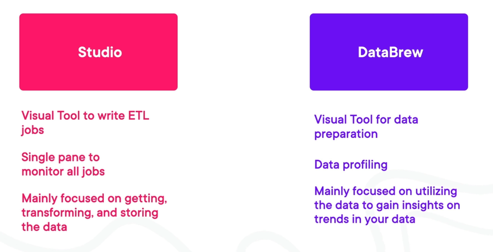

# AWS Glue
- Ingestion tool for data.
- [07A-Serverless Computing](../../Cloud%20Practitioner%20(CLF-C02)/AWS%20Cloud%20Practitioner%20Essentials/Module%202%20-%20Compute%20in%20the%20Cloud/07A-Serverless%20Computing.md) solution for discovering, prepping, and combining data.
- Is a collection of capabilities within one service that consists of ETL jobs, Data Catalog, Glue Studio, Data Quality, and DataBrew.
- Allows to gather data, process it with an ETL, catalog it, and send it to a consumption service.
- Able to interact with AWS and third-party services with low effort.
- With Event-Driven Triggers, you can configure AWS glue workflows to start automatically in response to events. 
- Time-Based Triggers: Allows you to schedule workflows at specific intervals or particular dates and times.
- On-Demand Triggers: Allows you to start your workflows based on a schedule or at any time on-demand.

## Glue Use Cases
- Allows you to complete ETL jobs.
- Data cataloging.
- Unique view of data from different sources.

## Benefits
- Fully managed service.
- Allows for the integration of large amounts of data to multiple services.
- Allows you to consume process and buffer data in real time.
- Allow for real-time metrics and reporting across various services.

## Glue ETL Job
- Serverless way to use ETL(Extract, Transform, Load) data integration.
	- Allows for multiple data sources including [14B-Amazon Simple Storage Service(S3)](../../Cloud%20Practitioner%20(CLF-C02)/AWS%20Cloud%20Practitioner%20Essentials/Module%205%20-%20Storage%20and%20Databases/14B-Amazon%20Simple%20Storage%20Service(S3).md), [17B-Amazon DynamoDB](../../Cloud%20Practitioner%20(CLF-C02)/AWS%20Cloud%20Practitioner%20Essentials/Module%205%20-%20Storage%20and%20Databases/17B-Amazon%20DynamoDB.md), and [16B-Amazon Relational Database Service(RDS)](../../Cloud%20Practitioner%20(CLF-C02)/AWS%20Cloud%20Practitioner%20Essentials/Module%205%20-%20Storage%20and%20Databases/16B-Amazon%20Relational%20Database%20Service(RDS).md).
	- Able to build ETL jobs utilizing different methods including Python Shell, Glue Streaming, and Cloud Studio.
- There are 4 types of Data Processing Units(DPUs):
	- G.1X: For memory-intense workloads.
	- G.2X: For workloads with ML transformations.
	- G.025X: For low volume and or sporadic data.
	- Standard: Not recommended on versions of Glue later the V 1.0

## Data Catalog
- Simplifies the management of metadata for your data assets.
	- Allows to create a Metadata Store for your data assets.
	- Active table definition including column names, data types, and other attributes.
	- Automatically infer the schema of the database.

## Glue Studio
- Simplifies the development and management of ETL workflows by providing a visual interface, built-in transforms, and seamless integration with AWS Glue ETL for scalable data processing in the Cloud.
- A way to visually write an ETL job:
	- For example, it allows you to drag and drop functions to build transformation logic.
- Enables job orchestation and monitoring:
	- Allows you to create ETL jobs and pipelines, scheduling them to run at specified intervals or in response to triggers such as data arrival or events.

## Glue DataBrew
- A visual data preparation tool that allows you to use programming languages or SQL to process your data.
- Allows for visual data preparations to explore and interact with your datasets.
- Provides a wide range of built-in data transformation functions to apply datasets.

## Glue Studio VS Glue DataBrew

