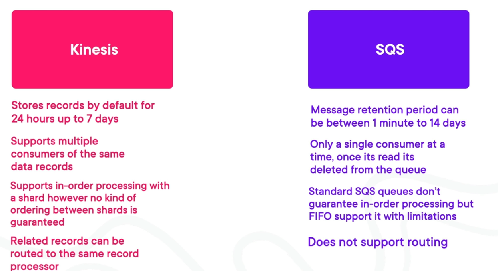
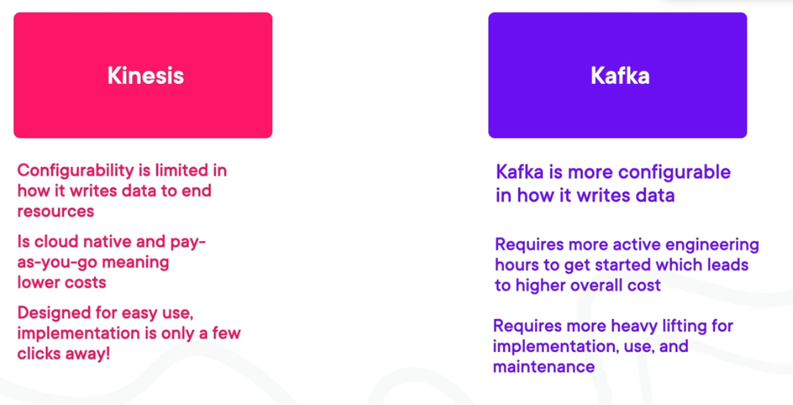
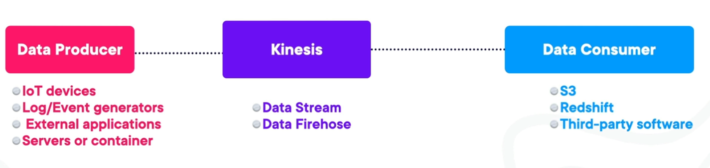

# Amazon Kinesis
- Allows you process and analyze streaming data.
- Is a family of services that consists of Data Streams, Data Firehose, Video Streams and Managed Apache Flink.
- These services aid in the collection, delivery, and analytics of streaming data.
- They are able to interact with AWS third-party services with low effort.

## Use Cases
- Anomaly detection in IoT.
- Log Processing for Machine Learning.
- Pattern Detection.
- Click Stream Analysis.

## Benefits
- Fully managed service.
- Serverless.
- Allows you to capture streaming data in near real-time.
- Built-in Autoscaling

## Kinesis VS SQS

## Kinesis VS Kafka

## Data Streams
- Serverless way to stream and store data.
	- Each Stream is composed of a sequence of Shards containing data records.
	- Data record: Contains a sequence number, partition key, and a blob up to 1MB.
- There are 2 sides of a stream:
	- Data Producers: Applications that ingests incoming data into a Stream in near real-time.
	- Data Consumers: Applications that takes that collected data and processes or stores it.

	

## Data Firehose
- Delivery Stream: Allows you to send data from AWS services or third-party services.
- Allows to store data or to send it to services to process the data.

## Managed Service for Apache Flink(Data Analytics)
- Allows to use programming languages or SQL to process your data.
- Allows you to use notebooks to run commands against your data.